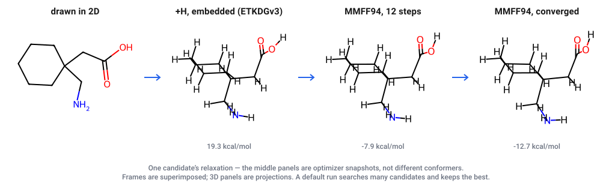
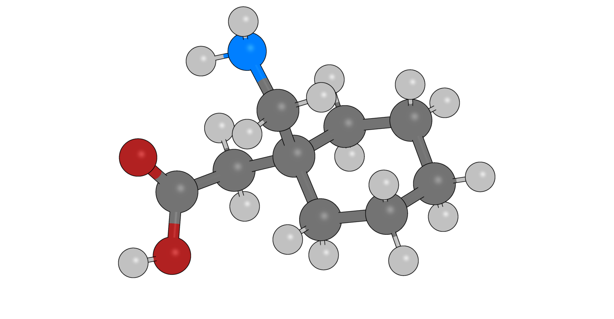

# ligand3d

**Turn a 2D molecule into a minimized 3D structure.** A SMILES string, a name, a MOL/SDF
file, or something you draw in the browser goes in; a 3D conformer comes out, minimized at
the level of theory you pick, with its stereochemistry verified rather than assumed.

<p align="center">
  
</p>
<p align="center">
  
  <br>
  <sub><b>…and out comes a real 3D structure.</b> This is the mmCIF that run wrote,
  opened in PyMOL — nothing redrawn for the picture.</sub>
</p>

It writes **mmCIF and SDF** by default — mmCIF because it carries bond orders and
aromaticity reliably, which PDB does not — plus PDB, a Rosetta params set, or an
annotated CIF for RFdiffusion4 on request.

```bash
ligand3d sketch                                            # draw it in a browser
ligand3d build "O=C1CN2CCC1CC2" -o quinuclidinone.cif      # or straight from SMILES
ligand3d fetch "3-Cyano-7-ethoxycoumarin"                  # or look it up by name
ligand3d doctor                                            # what is available, and why
```

## Quickstart

**At the IPD, on digs** — nothing to install:

```bash
source /net/software/lab/ligand3d/setup
ligand3d sketch
```

Over SSH, forward the port it prints (`ssh -N -L 8765:127.0.0.1:8765 <node>`), then open
<http://127.0.0.1:8765/>. Shared weights and containers are already on `/net`.

**Anywhere else:**

```bash
git clone https://github.com/SethWoodbury/ligand3d && cd ligand3d
uv venv && uv pip install -e ".[xtb,protonation,names]"
uv run ligand3d sketch
```

That gives you MMFF94, UFF, GFN1/GFN2-xTB, pH-based protonation and offline name lookup.
See **[docs/install.md](docs/install.md)** for the neural potentials and DFT.

## What you can minimize with

Chain them cheap to expensive with commas — `-b mmff94,gfn2,orca-wb97x3c`. Each link
refines what the last produced, and only the survivors reach the expensive end.

| Tier | Examples | Cost, gabapentin |
|---|---|---|
| Classical force field | `mmff94`, `uff` | 4 ms |
| Force field, quantum-derived | `gfnff` | 0.06 s |
| Semi-empirical | `gfn1`, `gfn2`, `gxtb` | 0.1–0.6 s |
| Machine-learned | MACE, eSEN, UMA, AllScAIP, AIMNet2 | 0.5 s – 2 min |
| DFT and Hartree–Fock | 14 levels via ORCA | minutes to hours |

`ligand3d models` prints the full table with measured timings, memory and capabilities.
**[docs/methods.md](docs/methods.md)** explains how to choose.

## Documentation

| | |
|---|---|
| **[Installing](docs/install.md)** | what to install per tier, and where weights come from |
| **[Methods](docs/methods.md)** | every level of theory, what it costs, how to choose |
| **[ML potentials](docs/models.md)** | the neural tier and the environment split |
| **[Chemistry](docs/chemistry.md)** | stereochemistry, protonation, conformers, name lookup |
| **[Cluster](docs/cluster.md)** | SLURM, the IPD install, cutting a release |
| **[Output formats](docs/outputs.md)** | mmCIF, SDF, PDB, Rosetta params, RFdiffusion4 |
| **[How it works](docs/internals.md)** | the optimizer, measured accuracy, adding a method |
| **[AGENTS.md](AGENTS.md)** | driving ligand3d from an agent |

## Why this exists

Getting from a drawing to a usable 3D ligand is a five-minute job that everyone
re-implements badly. The parts that are easy to get wrong are the ones this tool
takes seriously:

- **Stereochemistry is verified, not assumed.** After embedding, the 3D structure's
  CIP labels are re-perceived and compared against what you drew. A mirrored
  stereocenter is an error, not a surprise you find three weeks later.
- **Your protonation state survives.** Minimizing gabapentin's zwitterion in gas phase
  destroys it — the proton hops back from N to O and you silently get a different
  molecule. ligand3d turns on implicit solvation for charged species and checks the
  connectivity afterwards.
- **Backends declare what they can do.** Some potentials consume total charge
  (GFN2-xTB, AIMNet2) and some do not (MACE-OFF, MACE-MP). Handing a carboxylate to a
  model with no charge channel is refused rather than quietly answered.


## Licensing, and what that means for the weights

**ligand3d itself is MIT.** Use it, fork it, ship it.

**The models it can run are not all MIT, and some are academic-use-only.** ligand3d
never redistributes weights — it resolves them from wherever you have them — so this is
a constraint on *you*, not on this repository, and it is easy to miss:

| Method | Licence | Commercial use |
|---|---|---|
| MMFF94, UFF (RDKit) | BSD-3 | yes |
| GFN1/GFN2-xTB (tblite), GFN-FF (xtb) | LGPL-3.0 | yes |
| g-xTB | LGPL-3.0, **beta** | yes, but results are provisional |
| AIMNet2 | MIT | yes |
| **MACE-OFF, MACE-OMOL, MACE-POLAR** | **[ASL](https://github.com/gabor1/ASL)** | **no — academic only** |
| **eSEN, UMA, AllScAIP** | **FAIR Chemistry License v1** | **no — academic only** |
| ORCA | free for academic use; [separate licence](https://orcaforum.kofo.mpg.de) otherwise | see their terms |

ASL is not an open-source licence: it is GPLv2-derived with a non-commercial clause. The
FAIR Chemistry License is similar in effect. If your work is commercial, the classical,
semi-empirical and AIMNet2 tiers are yours; the MACE and fairchem tiers are not.

The table above is the reference. At the IPD the lab model registry records the licence
per checkpoint and will answer programmatically, which is what to use if you are building
something that has to decide:

```python
import sys; sys.path.insert(0, "/net/databases/huggingface/mlFF_models")
from mlff_registry import info
info("mace-polar")["licence"]        # 'ASL (academic use only)'
```

`ligand3d models --verbose` prints each method's training data and reference, though not
yet its licence.


## Citing

If ligand3d is useful in published work, please cite the **methods**, which are other
people's research, rather than this tool. `ligand3d models --verbose` prints the reference
for whichever method you ran. The ones most likely to matter:

- **MACE-OFF / MACE-POLAR** — Kovács et al., and Batatia et al., *MACE-POLAR-1*
  ([arXiv:2602.19411](https://arxiv.org/abs/2602.19411))
- **eSEN / UMA / OMol25** — Meta FAIR Chemistry, the OMol25 dataset and models
- **GFN2-xTB / GFN-FF / g-xTB** — Grimme and co-workers
- **ORCA** — Neese, and the functional and dispersion correction you actually used, which
  is why each level of theory has its own backend name here
- **RDKit** and **ETKDGv3** (Riniker & Landrum) for the embedding


## Built on

**Always present**

- [RDKit](https://www.rdkit.org/) — ETKDGv3 embedding, MMFF94/UFF, 2D depiction
- [gemmi](https://gemmi.readthedocs.io/) — mmCIF, which is the default output
- [Typer](https://typer.tiangolo.com/) and [Rich](https://rich.readthedocs.io/) — the CLI

**Optional, by tier**

- [tblite](https://github.com/tblite/tblite) — GFN1/GFN2-xTB
- [xtb](https://github.com/grimme-lab/xtb) — GFN-FF, and
  [CREST](https://github.com/crest-lab/crest) for conformer search
- [g-xTB](https://github.com/grimme-lab/g-xtb) — a patched xtb build; beta
- [ASE](https://wiki.fysik.dtu.dk/ase/) — the optimizer for every backend except the
  RDKit force fields and GFN-FF, which optimize internally
- [MACE](https://github.com/ACEsuit/mace) — MACE-OFF, MACE-MP, MACE-OMOL, MACE-POLAR,
  the last needing [graph_electrostatics](https://github.com/WillBaldwin0/graph_electrostatics)
- [fairchem](https://github.com/FAIR-Chem/fairchem) — eSEN, UMA, AllScAIP
- [AIMNet2](https://github.com/isayevlab/aimnetcentral)
- [ORCA](https://orcaforum.kofo.mpg.de) — the DFT and Hartree-Fock tier
- [dimorphite-dl](https://github.com/durrantlab/dimorphite_dl) — protonation states
- [py2opsin](https://github.com/JacksonBurns/py2opsin) wrapping
  [OPSIN](https://github.com/dan2097/opsin) — systematic names, offline
- [JSME](https://jsme-editor.github.io/) — the browser sketcher


## Author

Seth M. Woodbury — [github.com/SethWoodbury](https://github.com/SethWoodbury)


## License

MIT.
