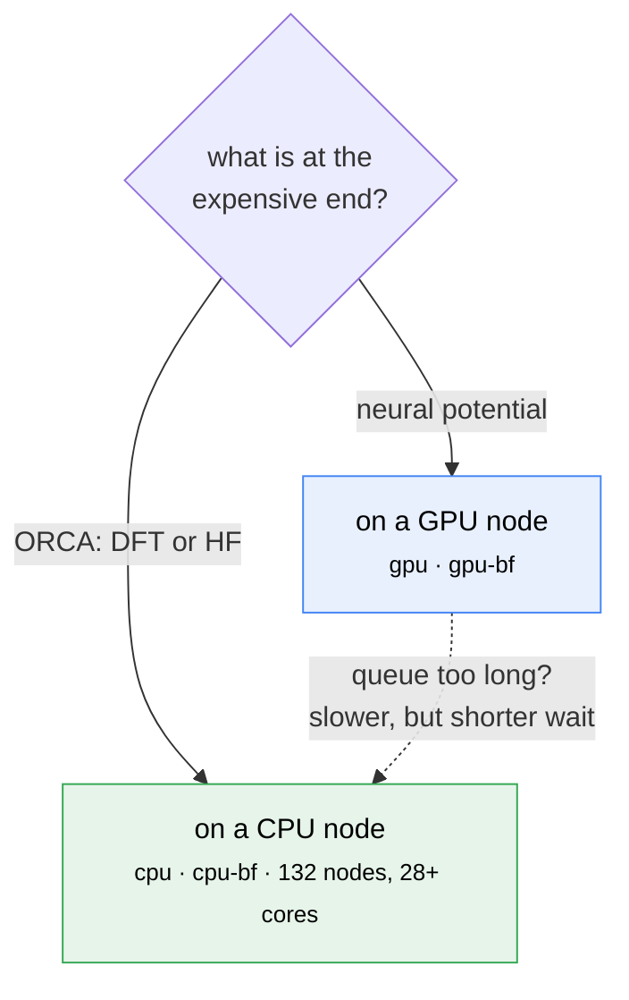
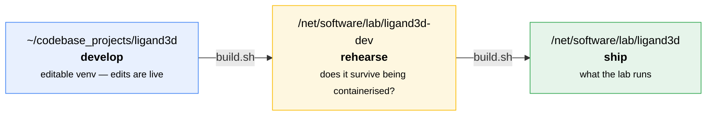

# Running on the cluster

SLURM submission, the IPD installation, and how a release is cut.

[← back to the README](../README.md)

## Running it on the cluster (SLURM, at the IPD)

Everything above runs on whatever machine you are sitting at. On the IPD cluster you can
hand a build to a compute node instead — a GPU one, or a CPU one:

```bash
ligand3d build "NCC1(CC(=O)O)CCCCC1" -b mace-off -n 3 --slurm      # GPU
ligand3d build "<smiles>" -b mmff94,orca-wb97x3c --slurm --slurm-partition cpu
ligand3d slurm                      # can this host submit? what containers are there?
ligand3d slurm --job 18977069       # what happened to that job?
```

In the sketcher, **Run** offers both, and the option only appears when the host can
actually submit — nowhere else is shown a control that could only fail.



**Which node.** ORCA is MPI-parallel across cores and gains nothing from a GPU, so a DFT
job on the `gpu` partition holds a card it never touches while queueing behind work that
needs one. The page points you at the CPU option for quantum chemistry, and notes the
slowdown if you send a neural potential there — but it does not decide for you, because
the `cpu` queue is often much shorter and that is a legitimate reason to take it.

**What you can set.** Partition, walltime, CPU cores, memory, account, and GPU class when
a GPU is involved. Choosing a CPU destination hides the GPU class and requests no GRES, so
there is no way to ask for a CPU partition and a card at once.

Nothing here changes where a build runs unless you say so: **a DFT chain does not
auto-submit.** Where it runs is only ever what **Run** says.

This is optional in the strongest sense: `slurm.py` is imported from exactly one place in
the CLI, nothing else in ligand3d touches it, and importing the package does not load it.
A machine with no scheduler behaves exactly as it did before the feature existed.

### Why it needs a container

**Yes, apptainer is required, and not as a convention.** The `torch` in this project's
virtualenv is the `+cpu` build. Submitting this interpreter to a GPU node would allocate
a GPU and then quietly ignore it — the slowest possible outcome, and one that looks like
success. The containers on `/net/software/containers` carry a CUDA torch, so the job runs
inside one:

| image | torch | potentials |
|---|---|---|
| `quantum_chem-20260604.sif` | 2.11.0+cu130 | MACE (all), MACE-POLAR, AIMNet2 |
| `uma-20260527.sif` | 2.8.0+cu128 | eSEN, UMA, AllScAIP |

The split is not arbitrary: it is the same e3nn incompatibility described above, which
exists inside the containers exactly as it does in a virtualenv. ligand3d picks the image
from the backend you asked for, and refuses a chain that mixes the two families *before*
submitting rather than letting it fail on a node ten minutes later.

Nothing is installed into the container. The package is copied into the job directory and
put on `PYTHONPATH`, which has a second benefit: a job that sits in the queue for an hour
runs the code that was submitted, not whatever the repo happens to contain when it
starts. The job directory ends up holding the sbatch script, the JSON payload, the exact
source that ran, both logs, and the result — enough to reproduce or explain the run later.

### Whether it is worth it

Measured with `mace-off` in the same container, one process, RTX 4000 Ada versus the four
CPU cores the job requested:

| work | CPU | GPU | speedup |
|---|---|---|---|
| gabapentin (29 atoms), 1 conformer | 4.94 s | 1.73 s | 2.9× |
| gabapentin, 10-conformer search | 163 s | 48.9 s | 3.3× |
| a 58-atom tripeptide, 1 conformer | 35.0 s | 7.65 s | 4.6× |
| the tripeptide, 10-conformer search | 749 s | 156 s | 4.8× |

**Single digits, not orders of magnitude.** That is the number worth internalizing before
building a workflow around this. A 29-atom graph does not come close to filling a GPU, and
L-BFGS is inherently sequential — every step needs the forces from the one before, so
there is nothing to overlap and kernel launch latency dominates. Conformers are minimized
one after another rather than batched, so a search multiplies the wall time rather than
hiding it.

The size dependence is the useful part: the speedup climbs from 2.9× to 4.8× between a
29-atom ligand and a 58-atom peptide, because a bigger graph gives the GPU more to do per
launch. That last row is where it starts to matter in practice — twelve and a half minutes
becomes two and a half. Extrapolate accordingly: small and rigid means run it locally, big
and floppy means the queue is worth the wait.

So the honest guidance is narrow:

- **Worth submitting** — a large or flexible molecule, a real conformer search through an
  expensive potential (`mace-off-large`, `mace-polar`, `mace-omol`), or a batch you would
  otherwise babysit.
- **Not worth submitting** — anything classical or semi-empirical, and any single small
  molecule. `mmff94` finishes in four milliseconds; you cannot beat that by waiting in a
  queue. ligand3d says so rather than silently obliging.

Every run now reports which processor the potential actually used:

```
· minimization time: mace-off 265.16s
· neural potential ran on GPU (NVIDIA RTX 4000 Ada Generation)
```

A neural potential falling back to CPU looks identical to one on a GPU, only slower, so
this line is worth reading before drawing conclusions about a timing.

### Resources and defaults

Defaults are one `gpu:small` GPU, 4 CPUs, 16 GB, one hour, on partition `gpu`, account
`IPD`. Override any of them:

```bash
ligand3d build LIG.sdf -b mace-polar --slurm \
  --slurm-partition gpu-bf --slurm-gpu large --slurm-time 04:00:00 \
  --slurm-cpus 8 --slurm-mem 32G --slurm-wait
```

GPU classes are `small`, `large`, and `h200` — the old `a4000`/`b4000` GRES names no
longer schedule, and asking for one is rejected here rather than pending forever. The
scheduler also refuses jobs under five minutes, which is checked before submission.

One trap is worth stating plainly, because it fails silently: **a compute node's `/tmp`
is its own.** A job writing there exits 0 and leaves nothing behind. Output and job
directories must be on `/home`, `/net`, or `/mnt` — exactly the paths the container
bind-mounts — and ligand3d refuses anything else, including otherwise-shared filesystems
the job would not be able to see.

Two smaller refusals, both for the same reason — SLURM reads `#SBATCH` paths literally
rather than through a shell, so it cannot be quoted around:

- A job or output path containing whitespace or shell characters is rejected rather than
  producing a script that breaks in a confusing way.
- `--slurm-dir` pointed at a directory whose `src/` is not a previous ligand3d snapshot is
  rejected, instead of deleting it to make room for one.

The default images live under `/net/software/containers/users/woodbuse/`, which is
world-readable on this cluster — anyone in the lab can submit against them, they just cannot
edit them, which is the right way round. Point at different images with `LIGAND3D_SIF_MACE`
and `LIGAND3D_SIF_FAIRCHEM`, and at a different account with `LIGAND3D_SLURM_ACCOUNT`.
`ligand3d slurm` prints which images it resolved, so a wrong path shows up before a job
does.


## Releasing it to the lab

Using it needs nothing but the `PATH` line in the [Quickstart](../README.md#quickstart) — this section
is for the person cutting the release.

### Three places, in order



**Develop in the checkout.** The venv is an editable install, so it imports
`src/ligand3d/` directly — edit a file and run it, no rebuild:

```bash
cd ~/codebase_projects/ligand3d && .venv/bin/ligand3d sketch
```

**Rehearse in `ligand3d-dev`.** A change can be perfect in the venv and still break once
containerised — a missing system library, a probe path that does not exist inside, a file
that was never copied. That has happened repeatedly here: `libgomp1`, `libXrender`,
`libexpat`, the ORCA wrapper, `graph_longrange`. None of them could fail in a venv. It
lives on `/net` rather than in `$HOME` so the rehearsal uses the same filesystem and
permissions as the real thing.

```bash
LIGAND3D_ALIAS=ligand3d-dev container/build.sh /net/software/lab/ligand3d-dev
ligand3d-dev doctor          # and whatever you changed
```

**Then ship.**

```bash
LIGAND3D_ALIAS=ligand3d-lab container/build.sh /net/software/lab/ligand3d
git tag -a v0.3.1 -m "..." && git push origin v0.3.1
```

### Addressing them

```bash
export PATH=/net/software/lab/ligand3d:/net/software/lab/ligand3d-dev:$PATH
```

| Command | Runs |
|---|---|
| `ligand3d` | the shipped copy — the safe default, and what a labmate gets |
| `ligand3d-lab` | the shipped copy, explicitly |
| `ligand3d-dev` | the rehearsal copy |

The shipped directory comes first deliberately: an unqualified `ligand3d` should be the
thing everyone else is running, and reaching the release candidate should take saying so.
Labmates add only the first path and never see `ligand3d-dev` at all.

`container/build.sh` produces a directory holding the images, a launcher, and a `VERSION`
note saying what is in them. Everything is world-readable, so a labmate needs only that
one `PATH` entry.

```bash
container/build.sh                    # into ./dist
container/build.sh /net/software/lab/ligand3d
```

A shared destination is built locally and copied at the end, each image verified by
checksum, with the release it replaced kept beside it as `.previous`. A failed build or a
bad copy leaves the live release untouched. The build context is a filtered export of the
checkout rather than the checkout itself — otherwise `%files` copies `.venv`, which is 1.6
GB of the wrong platform's wheels and turns a four-minute release into twenty.

The build runs `container/selfcheck.py` inside each image and **fails rather than producing
one that cannot do what it claims** — imports, a JRE for OPSIN, every required backend, the
family's own neural module, and a real end-to-end build. That check has earned itself
three times: a missing `libgomp1`, which made GFN1/GFN2 fail at import with a message
naming no library; `xtb` absent so GFN-FF was silently unavailable; and `graph_longrange`
missing, which would have shipped a MACE image whose POLAR models could not be unpickled.

**The source is baked into the image**, so a run is pinned to a released version rather
than to whatever happens to be checked out — a colleague's results cannot change because you were mid-edit. The
trade is that a code change needs a rebuild before it reaches anyone.


### Why there are three images, and not one or twenty

**One image per dependency conflict.** There is exactly one: `mace-torch` pins
`e3nn==0.4.4` and `fairchem-core` needs `e3nn>=0.5`. That is two groups, so:

| image | size | neural family |
|---|---|---|
| `ligand3d.sif` | 394 MB | none |
| `ligand3d-mace.sif` | 770 MB | MACE, MACE-POLAR, AIMNet2 |
| `ligand3d-fairchem.sif` | 1.1 GB | eSEN, UMA, AllScAIP |

A container per *method* would be the wrong shape: all the MACE variants share one
environment happily, and torch is most of the size, so twenty images would mean twenty
copies of torch to solve a problem that has two sides.

**Every image carries the full non-neural feature set** — tblite, protonation, name
lookup, the sketcher, params, the annotated CIF. That is the property that matters, and
it is what the earlier arrangement got wrong: borrowing the lab's general-purpose
`quantum_chem` image gave you MACE but no tblite, so `-b gfn2,mace-off` failed partway
through with an error telling you to pip install into a read-only container. Now the whole
chain runs in one place.

The launcher reads the backend and picks the image. If a family image is missing it falls
back to the lab's, warns, and says what is unavailable in it.

`container/build.sh` builds all three; `LIGAND3D_FAMILIES="core mace"` builds a subset.

One thing does not work from a container, and the launcher says so rather than failing
obscurely:

- **`--container`** is redundant here and nested apptainer does not work anyway; the
  launcher already does that dispatch.

### Or install it normally

Nothing about the container is required. A checkout works as it always has, and is what
you want if you are editing the code or submitting to SLURM:

```bash
git clone git@github.com:SethWoodbury/ligand3d && cd ligand3d
uv venv && uv pip install -e ".[xtb,protonation,names]"
```
