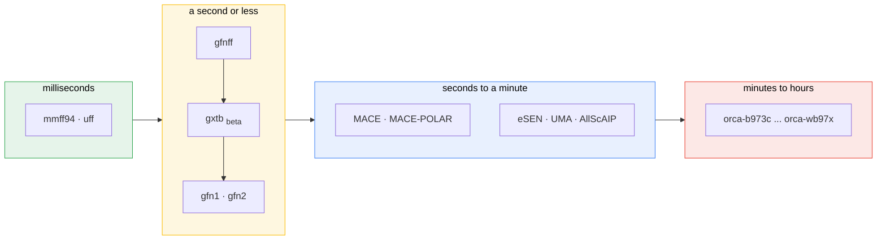

# Methods

Every level of theory ligand3d can run, what each costs, and how to choose between them.

[← back to the README](../README.md)

## Backends

| id | kind | takes charge | solvation | speed (gabapentin) |
|---|---|---|---|---|
| `mmff94` | classical FF | implicit in typing | no | 4 ms |
| `uff` | classical FF | implicit in typing | no | 4 ms |
| `gfnff` | generic FF (xtb) | yes | ALPB | 0.06 s |
| `gxtb` | semi-empirical, **beta** | yes | **no** | 0.11 s |
| `gfn2` | semi-empirical | yes | ALPB | 0.33 s |
| `gfn1` | semi-empirical | yes | ALPB | 0.57 s |
| ML potentials | see below | varies | no | 0.5 s to a minute |
| `orca-*` | DFT + HF, 14 levels | yes (+ spin) | CPCM | 25 s for methanol, climbing steeply |



### xtb, GFN-FF, GFN2, g-xTB — which is which

`xtb` is a *program*, not a method, and it carries several. They are not
interchangeable:

- **GFN-FF** (`gfnff`) is a force field. No electrons, fast, parameterised across the
  periodic table. Good geometries for what it costs.
- **GFN1/GFN2-xTB** (`gfn1`, `gfn2`) are semi-empirical tight binding — approximate
  quantum mechanics. `xtb` is an alias for `gfn2`, which is the one you usually want.
- **g-xTB** (`gxtb`) is new, from 2026, and aims much higher: it is fit to reproduce
  wB97M-V/def2-TZVPPD, a hybrid-DFT level, while still finishing phenol in about a
  third of a second. That makes it a genuinely different point on the cost curve.

**g-xTB is a development release**, and the authors say so — the final implementation is
going into tblite. Treat its numbers as provisional. It also has **no implicit solvent**:
`--gxtb` with `--alpb` aborts, which is measured rather than assumed, so ligand3d declares
it and will not hand g-xTB a solvent model it cannot run. Charges are fine.

It needs the patched xtb build from [grimme-lab/g-xtb](https://github.com/grimme-lab/g-xtb/releases);
the stock binary has no `--gxtb`. The containers carry it already.

Chain them with a comma — cheap first, expensive last:

```bash
ligand3d build "NCC1(CC(=O)O)CCCCC1" --backend mmff94,gfn2
```

`ligand3d models` is the full reference — cost, memory, charge and spin handling,
training data, element coverage, and the resolved path of every checkpoint:

```bash
ligand3d models              # the table
ligand3d models --available  # only what runs here
ligand3d models -v           # plus training data, notes, and weight paths
```

The browser has the same thing at `/models`, filterable, linked from the header.
`ligand3d backends` is the short version; `ligand3d doctor` diagnoses what is missing.

Chains are not limited to the presets. Any comma-separated sequence works, on the command
line or via **build my own chain** in the browser:

```bash
ligand3d build "<smiles>" --backend mmff94,mace-mh,mace-off-large
```

The first method searches the conformers and the rest refine only the survivors, so put
the cheap one first.


## DFT

```bash
ligand3d build "<smiles>" -b mmff94,gfn2,orca -o thing.cif   # orca = B97-3c
ligand3d build "<smiles>" -b mmff94,gfn2,orca-wb97x          # or name the level
```

**"DFT" is not a method.** A geometry labelled that way cannot be written up or
reproduced — the functional, the basis and the dispersion correction are the answer. So
each level of theory is its own backend, and the name of the run records what ran:

| Backend | Level of theory | Rung | Needs |
|---|---|---|---|
| `orca-hf3c` | HF-3c | composite | any |
| `orca-pbeh3c` | PBEh-3c | composite | any |
| **`orca-b973c`** | **B97-3c** — also plain `orca` | composite | any |
| `orca-bp86` | BP86/def2-SVP D3(BJ) | GGA | any |
| `orca-tpss` | TPSS/def2-TZVP D3(BJ) | meta-GGA | any |
| `orca-b3lyp` | B3LYP/def2-TZVP D3(BJ) | hybrid | any |
| `orca-pbe0` | PBE0/def2-TZVP D3(BJ) | hybrid | any |
| `orca-wb97x` | wB97X-D3/def2-TZVP | range-separated | any |
| `orca-r2scan3c` | r2SCAN-3c | composite | ORCA 5+ |
| `orca-r2scan` | r2SCAN/def2-TZVP **D4** | meta-GGA | ORCA 5+ |
| `orca-wb97xd4` | wB97X-**D4**/def2-TZVP | range-separated | ORCA 5+ |
| `orca-wb97mv` | wB97M-V/def2-TZVPD | range-separated | ORCA 5+ |
| `orca-m062x` | M06-2X/def2-TZVP | hybrid meta-GGA | ORCA 5+ |
| **`orca-wb97x3c`** | **wB97X-3c** | composite | ORCA 6+ |

Every keyword line was run, not assumed — against both ORCAs on this cluster.

### Which ORCA you get, and why it matters

ligand3d uses the lab's verified **ORCA 6.1.1**. The 2019 4.1.1 at
`/net/software/orca/latest` is **deprecated and no longer probed**: falling back to it
silently would halve the available methods, and silently is the problem. If you genuinely
want an older ORCA, say so with `LIGAND3D_ORCA_BIN` — it still works for the composites,
warns that it is old, and names what it cannot do rather than discovering it mid-job:

```
orca-r2scan3c: r2SCAN-3c needs ORCA 5.0+; this one is 4.1
```

The version comes from that tree's `registry/installations.toml` when the resolved binary
lives inside it — 3 ms and better evidence than a banner, and the registry also records
whether the install passed its smoke tests. Otherwise ligand3d runs ORCA once and reads
the banner, since ORCA does not answer `--version`. Set `LIGAND3D_ORCA_BIN` to override.

> **wB97X-3c energies are not comparable to the others.** Its vDZP basis carries
> effective core potentials, so methanol comes out at −24 Eh rather than −115.6. That is
> the method behaving correctly, not a bug — but do not put it in a table beside an
> all-electron result. Conformer ranking within a run is unaffected, since every
> conformer uses the same method.

**Which to pick.** On ORCA 6, start with **`orca-wb97x3c`** — a range-separated hybrid composite is the
best geometry-per-second on offer. On an older ORCA, `orca-b973c`. Composites pair a
functional, a basis and the corrections that make the pairing behave, tuned together, and
are much cheaper than assembling the parts by hand.

Reach past them when you need a number rather than a geometry: `orca-wb97mv` is about the
most accurate thing here for organic molecules, and is the level **g-xTB is fit to
reproduce** — which makes it the natural reference to check `gxtb` against.

ligand3d drives the optimiser itself and asks ORCA only for gradients
(`ENGRAD`), so DFT produces the same trace and obeys the same convergence
criterion as every other backend rather than being a special case.

The sensible use is the last link in a chain: search with MMFF94, narrow with
GFN2, spend DFT only on what survives.

On water, against experiment (0.958 Å, 104.5°):

| | O–H | H–O–H |
|---|---|---|
| `mmff94` | 0.969 Å | 104.0° |
| `gfn2` | 0.958 Å | 107.2° |
| `orca` (B97-3c) | 0.963 Å | 103.8° |

**A trap worth knowing about:** `orca` on PATH at the IPD is the *GNOME screen
reader*, not the quantum chemistry program. Resolution checks that the binary it
found is actually ORCA — a 13 KB Python script with no `orca_scf` beside it is
not an SCF driver — and finds the real one at `/net/software/orca/latest/orca`.


## Implicit solvent

`gfn1`, `gfn2`, and `gfnff` support ALPB implicit solvation with 25 parameterized
solvents. `ligand3d solvents` lists them with dielectric constants:

```bash
ligand3d build "<smiles>" --backend gfn2 --solvent dmso
ligand3d build "<smiles>" --backend gfn2 --solvent woctanol   # the logP phase
ligand3d solvents
```

water, methanol, ethanol, acetonitrile, dmso, dmf, acetone, thf, dichloromethane,
chloroform, ethylacetate, diethylether, dioxane, toluene, benzene, hexane, hexadecane,
octanol, woctanol, phenol, aniline, benzaldehyde, nitromethane, furane, carbondisulfide —
plus the aliases `h2o`, `ch2cl2`, `chcl3`, `ether`, `cs2`.

Solvent names are validated before any work starts, because tblite rejects an unknown one
with a message that does not say what the alternatives are. **Cyclohexane, octane and
heptane are not in the ALPB table** despite being obvious things to reach for, so asking
for them names the nearest stand-in instead of just failing:

```console
$ ligand3d build "CC(=O)O" --backend gfn2 --solvent cyclohexane
error: ALPB has no parameters for 'cyclohexane'. The closest available solvent
is 'hexane'. Run 'ligand3d solvents' for the full list.
```

Water is still applied automatically to charged and zwitterionic species unless you pass
`--solvent none`. The machine-learned potentials have no implicit solvent model at all,
which is why they are the wrong tool for a zwitterion regardless of charge handling.


## Choosing a backend

- **Default, and fine for most work** — `mmff94`. Four milliseconds, and geometry that is
  perfectly reasonable for a starting structure.
- **When the geometry matters** — `mmff94,gfn2`. Under a second, near-QM bond lengths and
  angles, and the only tier with both a charge channel and implicit solvent.
- **Charged or zwitterionic** — `gfn2` with solvation, which is applied automatically.
  Avoid the neutral-trained MLFFs entirely; ligand3d refuses those pairings anyway.
- **When you want a neural potential** — `mmff94,aimnet2` is the fastest charge-aware
  option; `mmff94,mace-off` if the molecule is neutral and organic.
- **Long-range electrostatics matter** — `mace-polar`, and budget a minute per molecule.
- **Inorganic or metal-containing** — `mace-mp`, which is the only one trained for it.
